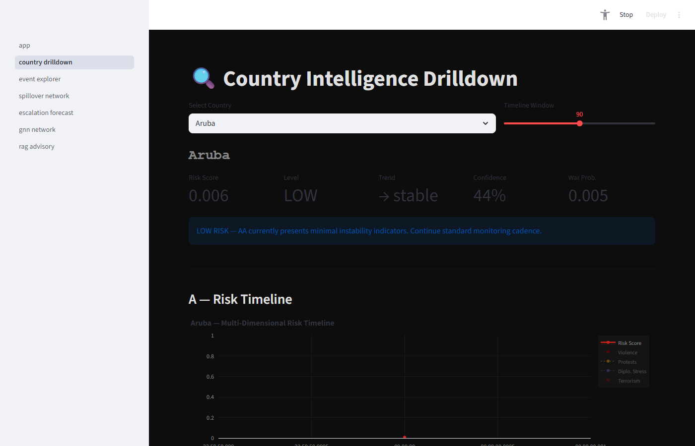
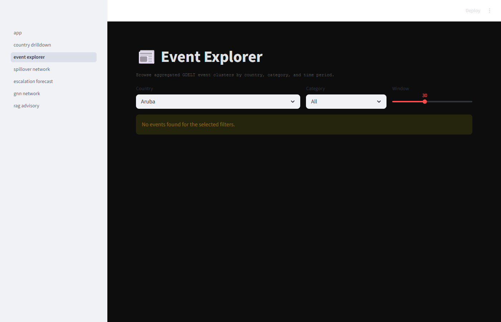
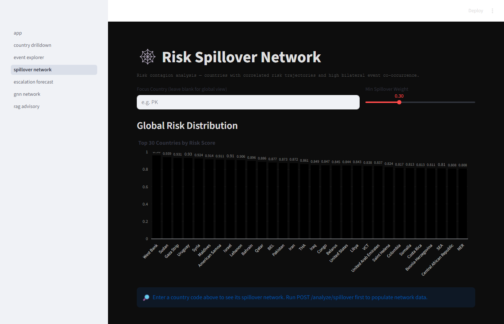
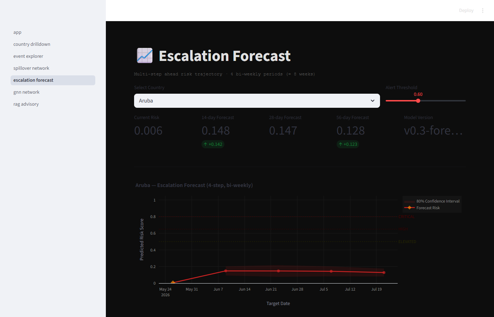
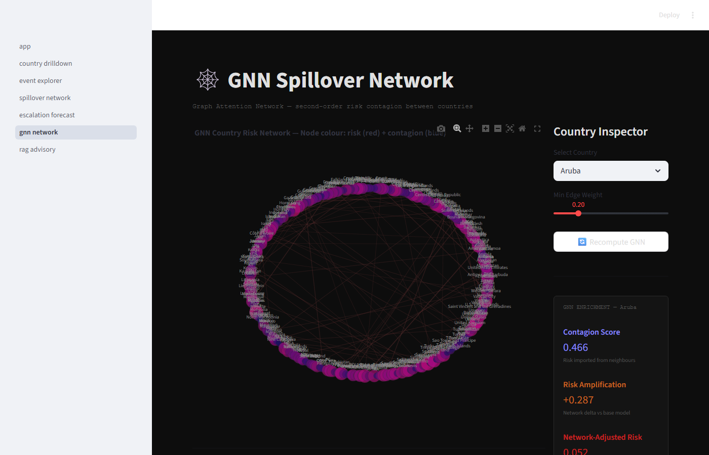
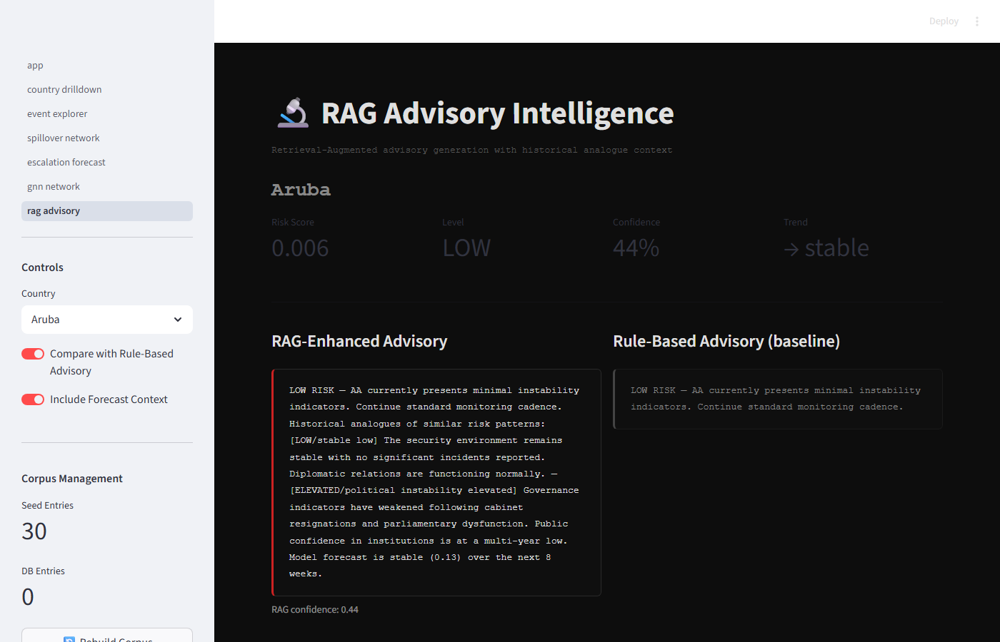

# GeoPulse — Global Risk Intelligence Platform

> **Geopolitical escalation monitoring and forecasting powered by GDELT**

A full-stack machine-learning platform that ingests the Global Database of Events, Language, and Tone (GDELT), extracts multi-dimensional country risk features, trains deep-learning models for risk scoring and escalation forecasting, and surfaces everything through an interactive dark-themed intelligence dashboard.

---

## Table of Contents

1. [Overview](#overview)
2. [Performance](#performance)
3. [Architecture](#architecture)
4. [Tech Stack](#tech-stack)
5. [Project Structure](#project-structure)
6. [Database Schema](#database-schema)
7. [ML Models](#ml-models)
8. [REST API Reference](#rest-api-reference)
9. [Dashboard — UI Pages](#dashboard--ui-pages)
10. [Quick Start (Local)](#quick-start-local)
11. [Docker Deployment](#docker-deployment)
12. [Configuration](#configuration)
13. [Training the Models](#training-the-models)
14. [Data Pipeline](#data-pipeline)

---

## Overview

GeoPulse pulls daily GDELT event exports, parses and cleans the raw CAMEO-coded events, aggregates them into per-country feature vectors (protests, military events, terrorism, diplomatic stress, economic signals, sentiment), and feeds those features into a three-phase ML pipeline:

| Phase | What it does |
|---|---|
| **Phase 1** | `HybridRiskTransformer` — baseline multi-task risk scorer (risk score, instability, war probability, terrorism risk, financial stress) |
| **Phase 2** | Spillover network (Pearson-correlation graph), feature attribution (Integrated Gradients), event cluster visualisation |
| **Phase 3** | `EscalationForecaster` (4-step bi-weekly horizon), `RiskGNN` (Graph Attention Network for contagion scoring), TF-IDF RAG advisory generation |

All three phases are fully integrated in the FastAPI backend and exposed via a 7-page Streamlit dashboard.

---

## Performance

Evaluated via **walk-forward backtesting** — 53 bi-weekly expanding-window folds spanning January 2023 to March 2026, across 210 countries, producing 35,102 predictions with matched ground-truth risk scores. All evaluation is strictly temporal: no future data leaks into any fold.

### Per-horizon results

| Horizon | N predictions | MAE | RMSE | Directional accuracy | Skill vs. carry-forward |
|---------|--------------|-----|------|---------------------|------------------------|
| **14 days** | 9,203 | 0.1620 | 0.1969 | 70.6% | +14.4% |
| **28 days** | 8,822 | 0.1616 | 0.1967 | 71.6% | +16.0% |
| **42 days** | 8,613 | 0.1618 | 0.1972 | 70.7% | +15.4% |
| **56 days** | 8,464 | 0.1616 | 0.1965 | 70.5% | +16.0% |

Risk scores are on a continuous 0–1 scale. MAE and skill are computed against a carry-forward baseline (predicting the current risk score for all future horizons). Directional accuracy measures whether the model correctly predicts the sign of risk change (up or down); random baseline is 50%.

### Benchmark context (28-day horizon)

The 28-day directional accuracy of **71.6%** is comparable to the ~75% next-month accuracy reported for Random Forest models on GDELT binary instability forecasting (Zebrowski & Afli, SBP-BRiMS 2025; arXiv 2411.06639), while operating on the harder continuous regression target rather than a binary stable/unstable label.

The **+16.0% skill** over carry-forward is meaningful in the conflict-forecasting literature: the ViEWS Prediction Challenge (arXiv 2407.11045) — the primary public benchmark for country-level political violence forecasting — found that a no-change model outperformed all submitted ML models under the TADDA directional metric (arXiv 2304.12108), making positive skill over persistence the key test to clear.

Horizon stability (MAE within 0.0004 across 14–56 days) reflects the model's use of a compressed latent representation of the 90-day history rather than explicit trajectory extrapolation.

### Confidence interval calibration

Raw MC-Dropout intervals covered only **13%** of held-out actuals — consistent with prior work showing MC-Dropout captures only epistemic uncertainty, not aleatoric geopolitical volatility. GeoPulse applies **split-conformal calibration** (Angelopoulos & Bates, 2023) fit on backtest residuals, raising empirical coverage to **78%** on a chronologically held-out evaluation half with no retraining. Production intervals use per-horizon quantiles of ±0.26 (on the 0–1 scale), providing a finite-sample distribution-free coverage guarantee.

---

## Architecture

```
┌─────────────────────────────────────────────────────────────────┐
│                        GDELT Data Source                         │
│           http://data.gdeltproject.org  (daily ZIP CSV)          │
└──────────────────────────┬──────────────────────────────────────┘
                           │  ingestion/
                           ▼
┌─────────────────────────────────────────────────────────────────┐
│                      Ingestion Pipeline                          │
│  gdelt_downloader → gdelt_parser → event_cleaner → db_writer    │
└──────────────────────────┬──────────────────────────────────────┘
                           │  PostgreSQL 18 / TimescaleDB
                           ▼
┌──────────────────────────────────────────────────────────────────┐
│  gdelt_events (partitioned)  │  ingestion_runs  │  audit tables   │
└──────────────────────────┬───────────────────────────────────────┘
                           │  preprocessing/
                           ▼
┌──────────────────────────────────────────────────────────────────┐
│  feature_extractor  →  country_daily_features                    │
│  label_generator   →  country_multitask_labels                   │
│  event_clusterer   →  event_clusters                             │
└──────────────────────────┬───────────────────────────────────────┘
                           │  inference/
                           ▼
┌─────────────────┬──────────────────────┬────────────────────────┐
│  risk_scorer    │  escalation_          │  gnn_spillover         │
│  (Phase 1)      │  forecaster (Ph. 3)   │  (GAT — Phase 3)       │
└─────────────────┴──────────┬────────────┴────────────────────────┘
                             │
                             ▼
┌──────────────────────────────────────────────────────────────────┐
│               FastAPI Backend  (backend/main.py)                 │
│  30+ REST endpoints · MCP-compatible /riskscore                  │
└──────────────────────────┬───────────────────────────────────────┘
                           │  HTTP
                           ▼
┌──────────────────────────────────────────────────────────────────┐
│              Streamlit Dashboard  (streamlit_app/)               │
│  7 pages · Plotly choropleth · dark intel-dashboard aesthetic    │
└──────────────────────────────────────────────────────────────────┘
```

---

## Tech Stack

| Layer | Technology |
|---|---|
| **Language** | Python 3.10+ |
| **Web framework** | FastAPI 0.115 + Uvicorn |
| **Database** | PostgreSQL 18 + TimescaleDB + pgvector + PostGIS |
| **ML framework** | PyTorch 2.4 |
| **Deep learning** | Transformer encoder (Phase 1), LSTM forecaster (Phase 3), Graph Attention Network (Phase 3) |
| **Data ingestion** | pandas, requests, APScheduler |
| **Dashboard** | Streamlit 1.40 + Plotly 5.24 |
| **Explainability** | Integrated Gradients (custom implementation) |
| **RAG** | TF-IDF cosine retrieval (scikit-learn) + optional Ollama for narrative polishing |
| **Containerisation** | Docker Compose (Postgres + Backend + Streamlit + optional Ollama) |

---

## Project Structure

```
geopulse/
├── backend/
│   └── main.py                       # FastAPI app — all 30+ routes
├── inference/
│   ├── risk_scorer.py                # Phase 1: HybridRiskTransformer scorer
│   ├── spillover.py                  # Phase 2: correlation-based spillover
│   ├── explainer.py                  # Phase 2: Integrated Gradients attribution
│   ├── escalation_forecaster.py      # Phase 3: multi-step LSTM forecaster
│   ├── gnn_spillover.py              # Phase 3: Graph Attention Network
│   └── rag_engine.py                 # Phase 3: TF-IDF RAG advisory engine
├── models/
│   ├── risk_model.py                 # HybridRiskTransformer architecture
│   ├── forecaster.py                 # EscalationForecasterModel (LSTM)
│   ├── gnn.py                        # RiskGNN — Graph Attention Network
│   ├── dataset.py                    # Phase 1 PyTorch dataset
│   └── forecaster_dataset.py         # Phase 3 PyTorch dataset
├── preprocessing/
│   ├── feature_extractor.py          # GDELT events → daily feature vectors
│   ├── label_generator.py            # Proxy labels for training
│   ├── event_clusterer.py            # Cluster events by category per day
│   └── normalizer.py                 # Feature scaling utilities
├── ingestion/
│   ├── ingestion_pipeline.py         # Orchestrates download → parse → write
│   ├── gdelt_downloader.py           # Fetches GDELT daily ZIPs
│   ├── gdelt_parser.py               # Parses GDELT CSV → clean DataFrame
│   ├── event_cleaner.py              # Deduplication, validation
│   └── db_writer.py                  # Bulk upserts into PostgreSQL
├── advisory/
│   ├── rule_engine.py                # Rule-based risk classification + advisory
│   └── rag_advisory.py               # RAG text generation
├── data/
│   └── country_codes.py              # FIPS 10-4 → country name mapping (250+ entries)
├── streamlit_app/
│   ├── app.py                        # Page 1: Global Risk Map (home)
│   └── pages/
│       ├── 01_country_drilldown.py   # Page 2: Country Intelligence Drilldown
│       ├── 02_event_explorer.py      # Page 3: Event Explorer
│       ├── 03_spillover_network.py   # Page 4: Risk Spillover Network
│       ├── 04_escalation_forecast.py # Page 5: Escalation Forecast
│       ├── 05_gnn_network.py         # Page 6: GNN Spillover Network
│       └── 06_rag_advisory.py        # Page 7: RAG Advisory Intelligence
├── evaluation/
│   ├── backtester.py                 # Walk-forward backtester (expanding window, batched inference)
│   ├── calibration.py                # Split-conformal calibration (ConformalCalibrator)
│   ├── metrics.py                    # HorizonMetrics, per-tier metrics, skill score
│   └── results/
│       ├── backtest_results.json     # 35,102 predictions across 53 folds, 210 countries
│       └── conformal_quantiles.json  # Production conformal quantiles (±0.26 per horizon)
├── scripts/
│   ├── run_backtest.py               # CLI runner for walk-forward backtester
│   ├── calibrate_intervals.py        # Chronological-split conformal calibration + report
│   ├── seed_db_from_cache.py         # One-time DB seeding from parquet cache
│   ├── train_forecaster.py           # Phase 3 forecaster training
│   ├── train_phase2.py               # Phase 2 model training
│   └── compute_features.py           # Batch feature extraction
├── docker/
│   ├── docker-compose.yml
│   ├── Dockerfile.backend
│   └── init.sql                      # PostgreSQL schema + monthly partitions
├── configs/
│   └── settings.yaml                 # All project configuration
├── tests/                            # pytest unit + integration tests
├── requirements.txt
└── .env.example
```

---

## Database Schema

PostgreSQL 18 with TimescaleDB for time-series hypertables. Schema initialised via `docker/init.sql`.

| Table | Description |
|---|---|
| `gdelt_events` | Raw GDELT events, range-partitioned by month (2020–2026). Millions of rows. |
| `country_daily_features` | Aggregated daily feature vectors per country (protest_score, violence_score, diplomatic_stress, terrorism_score, avg_sentiment, economic_stress, …) |
| `country_risk_predictions` | Model output history — risk_score, instability, war_probability, terrorism_risk, financial_stress, confidence, trend |
| `country_multitask_labels` | Proxy ground-truth labels for training (instability_label, war_label, terrorism_label, financial_label) |
| `event_clusters` | Pre-aggregated event clusters by country × category × date (protest / military / terrorism / sanctions / diplomatic) |
| `country_spillover` | Pairwise spillover weights (Pearson correlation + bilateral event co-occurrence) |
| `country_escalation_forecasts` | 4-step bi-weekly forecasts per country per run |
| `gnn_node_embeddings` | GNN enrichment output — contagion_score, risk_amplification, network_adjusted_risk |
| `advisory_corpus` | TF-IDF retrieval corpus: 30 seed situations + auto-generated cluster entries |
| `ingestion_runs` | Audit log of every ingestion run (date, rows inserted, duration, status) |
| `latest_country_risk` | View: most recent risk score per country |

---

## ML Models

### Phase 1 — HybridRiskTransformer

A Transformer encoder that operates over a 90-day time-series of feature vectors per country.

- **Input:** `[batch, T=90, F=14]` feature tensor + binary mask
- **Output heads:** 5 parallel heads — risk_score, instability, war_probability, terrorism_risk, financial_stress
- **Architecture:** 3-layer Transformer encoder (d_model=64, 4 heads, dropout=0.1) → global mean pooling → shared dense → 5-head MLP
- **Training:** Multi-task weighted MSE, AdamW optimiser, cosine LR schedule
- **Checkpoint:** `models/real_data_model.pt`

### Phase 3 — EscalationForecaster (LSTM)

Sequence-to-sequence LSTM for 4-step bi-weekly risk trajectory prediction with calibrated confidence intervals.

- **Input:** 90-day feature history → LSTM encoder → 4 autoregressive decoder steps
- **Output per step:** risk_score, instability, war_probability, terrorism_risk, financial_stress, variance → 80% CI bounds
- **Parameters:** 936,069 (EscalationForecaster-LSTM-v1)
- **Uncertainty:** MC-Dropout (5 forward passes) for epistemic uncertainty; post-hoc split-conformal calibration for production-grade 80% coverage intervals
- **Evaluation:** 35,102 walk-forward predictions, 71.6% directional accuracy at 28-day horizon, +16.0% skill over carry-forward baseline
- **Fallback:** Linear trend extrapolation when no trained checkpoint is available
- **Checkpoint:** `models/checkpoints/forecaster_v1_best.pt`

### Phase 3 — RiskGNN (Graph Attention Network)

Graph neural network that propagates risk across the country spillover graph.

- **Nodes:** Countries with 6-dimensional feature embeddings (base risk scores)
- **Edges:** Pearson-correlation spillover pairs (93 pairs from 83 bi-weekly snapshots at threshold 0.25)
- **Architecture:** 2-layer GAT (8 attention heads) → per-node contagion score, risk amplification, network-adjusted risk
- **Output stored in:** `gnn_node_embeddings` table

### Phase 2 — Integrated Gradients (Explainability)

Feature attribution computed via Integrated Gradients against the Phase 1 model. For each prediction, 14 input features are ranked by their signed contribution — red bars increase risk, blue bars decrease it.

### Phase 3 — RAG Advisory Engine

TF-IDF cosine retrieval over 30 hand-crafted seed situation templates + auto-generated entries from event cluster data. For each country, the top-5 most similar historical situations are retrieved and injected as context into the advisory text, alongside the current forecast trajectory.

---

## REST API Reference

The FastAPI backend runs on `http://localhost:8000`. Interactive Swagger UI at `/docs`.

### Phase 1 — Core

| Method | Endpoint | Description |
|---|---|---|
| `GET` | `/health` | Health check + DB connectivity |
| `GET` | `/countries` | List all tracked countries (FIPS code + full name) |
| `GET` | `/country/{code}/timeline` | Historical risk timeline (configurable window) |
| `GET` | `/global/heatmap` | Latest risk score per country for world map |
| `POST` | `/riskscore` | **MCP-compatible** — structured risk score for a country |
| `POST` | `/ingest/trigger` | Trigger GDELT ingestion run (background task) |
| `GET` | `/ingestion/runs` | Ingestion audit log |

### Phase 2 — Events, Spillover, Explainability

| Method | Endpoint | Description |
|---|---|---|
| `GET` | `/country/{code}/events` | Pre-aggregated event clusters by category |
| `GET` | `/country/{code}/spillover` | Top spillover neighbours with weights |
| `GET` | `/country/{code}/attributions` | Integrated Gradients feature attribution |
| `GET` | `/country/{code}/labels` | Proxy training labels for inspection |
| `POST` | `/analyze/spillover` | Recompute spillover network (background) |
| `POST` | `/analyze/labels` | Regenerate proxy labels for a date range |
| `POST` | `/analyze/clusters` | Recompute event clusters for last 7 days |

### Phase 3 — Forecasting, GNN, RAG

| Method | Endpoint | Description |
|---|---|---|
| `GET` | `/country/{code}/forecast` | 4-step bi-weekly escalation forecast |
| `GET` | `/global/escalation_alerts` | Countries predicted to exceed a risk threshold |
| `GET` | `/country/{code}/gnn_influence` | GNN enrichment — contagion, amplification, adjusted risk |
| `GET` | `/global/gnn_network` | Full node + edge list for network visualisation |
| `GET` | `/country/{code}/rag_advisory` | RAG-enhanced advisory with retrieved analogues |
| `GET` | `/advisory/corpus/stats` | Advisory corpus statistics |
| `GET` | `/advisory/corpus` | Browse advisory corpus entries |
| `POST` | `/advisory/corpus/rebuild` | Rebuild TF-IDF corpus from event clusters |
| `POST` | `/forecast/trigger` | Trigger forecaster for all countries (background) |
| `POST` | `/analyze/gnn` | Trigger GNN enrichment computation (background) |

---

## Dashboard — UI Pages

The Streamlit dashboard uses a dark intelligence-terminal aesthetic — black/maroon/crimson palette, Courier New monospace typography, and risk badges (CRITICAL · HIGH · ELEVATED · MODERATE · LOW).

---

### Page 1 — Global Risk Map


The main home page. A full-width Plotly choropleth world map coloured dark-green → maroon → black by risk score. Hovering a country shows its full name, risk score, level, confidence, and trend. Below the map:

- **Stats row** — Countries Tracked · CRITICAL count · HIGH count · Global Avg Risk
- **Country Drilldown** — Select any country from a sorted dropdown (full names, not codes). A risk assessment card shows the score, level badge, trend arrow, and confidence %. A 90-day risk timeline shows the main risk trace plus violence, protest, diplomatic stress, and terrorism component lines (togglable via chart legend).
- **Highest Risk Countries table** — Top 20 countries with full name, FIPS code, risk score, confidence, trend, and last-updated date.

---

### Page 2 — Country Intelligence Drilldown



Deep-dive analysis for any country across five sections:

| Section | What it shows |
|---|---|
| **A — Risk Timeline** | Multi-trace line chart: risk score + violence / protests / diplomatic stress / terrorism / economic stress, all togglable via legend |
| **B — Event Clusters** | Category cards (Protest · Military · Terrorism · Sanctions · Diplomatic) with event count, total mentions, avg Goldstein; stacked mention bar chart over time; top actor-pair table |
| **C — Feature Attribution** | Integrated Gradients horizontal bar chart — which of 14 input features drove the current risk score (red = increases risk, blue = decreases) |
| **D — Spillover Network** | Top correlated neighbours with spillover weight and risk correlation bar+diamond chart |
| **E — Proxy Labels** | (Expander) Ground-truth proxy labels (instability / war / terrorism / financial) plotted over time |

---

### Page 3 — Event Explorer



Browse GDELT event clusters with live filtering:

- **Filters** — Country (full name dropdown), Category (All / Military / Terrorism / Protest / Sanctions / Diplomatic), Time Window (7–180 days)
- **Summary metrics** — Total event groups, total mentions, average Goldstein score, days covered
- **Category breakdown** — Horizontal bar chart of total mentions per category
- **Intensity over time** — Scatter+line chart of `|Goldstein|` intensity per category
- **Event Log table** — Sortable table with date, category, event count, mentions, Goldstein, tone, and max intensity

---

### Page 4 — Risk Spillover Network



Two modes controlled by the Focus Country input:

- **Global view (default)** — Bar chart of the top 30 countries by current risk score, coloured by risk level, with full country names on the x-axis.
- **Ego network view** — Enter a FIPS code (e.g. `SY`, `PK`, `RS`) to render a circular ego network centred on that country. Nodes are sized by risk score and coloured by risk level. Edge width scales with spillover weight. Below the graph, a table of top neighbours lists spillover weight, risk correlation, and co-occurrence score — all with full country names.

---

### Page 5 — Escalation Forecast



Multi-step ahead risk trajectory for any country:

- **Header metrics** — Current Risk · 14-day · 28-day · 56-day forecast scores with signed delta badges
- **Forecast chart** — Red line + 80% confidence interval ribbon. Horizontal dashed threshold lines for CRITICAL (0.80), HIGH (0.65), ELEVATED (0.50).
- **Step cards** — One card per forecast step with target date, predicted score, CI bounds, and confidence %
- **Per-task breakdown** — Dotted line chart of instability / war probability / terrorism risk / financial stress sub-components over 4 steps
- **Global Escalation Alerts table** — All countries predicted to exceed the configurable alert threshold, sorted by predicted risk, with country name, current vs predicted risk, delta, confidence, and target date

---

### Page 6 — GNN Spillover Network



Graph Attention Network visualisation of risk contagion:

- **Network graph** — Circular layout. Node colour blends red (high base risk) and blue (high contagion score). Node size scales with network-adjusted risk. Edge opacity scales with spillover weight. Full country names on each node.
- **Country Inspector panel** — Select any country to see its GNN enrichment: **Contagion Score** (blue — risk imported from neighbours), **Risk Amplification** (signed delta vs base model), **Network-Adjusted Risk** (final score post-propagation). Lists top 5 influencer countries with spillover weights.
- **Network Statistics** — Node count, edge count, average contagion score
- **Highest Contagion Scores table** — Top 10 countries sorted by imported risk, with full names

---

### Page 7 — RAG Advisory Intelligence



Retrieval-Augmented advisory generation:

- **Sidebar** — Country selector (full names), "Compare with Rule-Based Advisory" toggle, "Include Forecast Context" toggle, corpus statistics (Seed Entries · DB Entries), Rebuild Corpus button
- **Risk header** — Score, level badge, confidence %, trend for the selected country
- **Advisory panels (side-by-side)** — *Left:* RAG-Enhanced Advisory (red border, Courier New terminal style) — baseline text enriched with retrieved historical analogues and 8-week forecast trajectory. *Right:* Rule-Based Advisory (grey border, baseline for comparison).
- **Retrieved Analogues** — Cards per context showing cosine similarity badge, risk level, situation type, full advisory text, and topic tags
- **Key Risk Drivers** — (Expander) Major drivers identified by the rule engine

---

## Quick Start (Local)

### Prerequisites

- Python 3.10+
- PostgreSQL 18 with extensions: `timescaledb`, `pgvector`, `postgis`, `pg_trgm`, `btree_gin`

### 1. Clone and install

```bash
git clone <repo-url>
cd geopulse
pip install -r requirements.txt
```

### 2. Configure environment

```bash
cp .env.example .env
# Edit .env — set your POSTGRES_USER / POSTGRES_PASSWORD / POSTGRES_DB
```

### 3. Set up the database

```sql
-- As PostgreSQL superuser:
CREATE ROLE gldt WITH LOGIN PASSWORD 'gldt_secret';
CREATE DATABASE gdelt_risk OWNER gldt;
\c gdelt_risk
\i docker/init.sql
```

### 4. Seed with sample data (skips GDELT download)

```bash
python scripts/seed_db_from_cache.py
# Loads 17,135 feature rows + 185 predictions + 93 spillover pairs from parquet cache
```

### 5. Start the backend

```bash
python -m uvicorn backend.main:app --port 8000 --reload
# Swagger UI → http://localhost:8000/docs
```

### 6. Start the dashboard

```bash
BACKEND_URL=http://localhost:8000 \
streamlit run streamlit_app/app.py --server.port 8502
# Dashboard → http://localhost:8502
```

---

## Docker Deployment

```bash
cd docker
cp ../.env.example ../.env      # fill in passwords
docker compose up -d
```

| Service | Port | Description |
|---|---|---|
| `postgres` | 5432 | TimescaleDB + pgvector + PostGIS |
| `backend` | 8000 | FastAPI + all inference engines |
| `streamlit` | 8502 | 7-page dashboard |
| `ollama` *(optional)* | 11434 | Local LLM for RAG narrative polishing |

---

## Configuration

All settings are in `configs/settings.yaml`:

```yaml
database:
  host: localhost
  port: 5432
  name: gdelt_risk
  user: gldt
  password: gldt_secret

gdelt:
  version: 1                     # GDELT 1.0 daily files
  scheduling:
    daily_cron: "0 2 * * *"      # run at 02:00 UTC each day
    backfill_days: 30

features:
  window_days: 90                # lookback window for feature extraction

model:
  path: "models/real_data_model.pt"
  device: "cpu"
```

Override via environment variables in `.env`.

---

## Training the Models

### Phase 1 — Risk Scorer

```bash
python scripts/train_real_data.py        # train on real GDELT features
# or:
python scripts/train_synthetic.py        # train on synthetic data (no DB needed)
# Checkpoint saved: models/real_data_model.pt
```

### Phase 2 — Spillover + Labels

```bash
# Generate proxy labels:
curl -X POST http://localhost:8000/analyze/labels \
     -H "Content-Type: application/json" -d '{"days": 90}'

# Compute spillover network:
curl -X POST http://localhost:8000/analyze/spillover \
     -H "Content-Type: application/json" -d '{"window_days": 90}'
```

### Phase 3 — Escalation Forecaster

```bash
python scripts/train_forecaster.py
# Checkpoint saved: forecaster_v1_best.pt
```

### Evaluation — Walk-Forward Backtest + Conformal Calibration

```bash
# Run full backtest (53 folds, 210 countries, ~2 min on GPU / ~30 min on CPU):
python scripts/run_backtest.py
# Results saved to evaluation/results/backtest_results.json

# Fit conformal calibration on backtest residuals and report coverage:
python scripts/calibrate_intervals.py
# Saves production quantiles to evaluation/results/conformal_quantiles.json
# The forecaster engine loads these automatically on next startup
```

### Phase 3 — GNN + RAG Corpus

```bash
# Run GNN enrichment (requires Phase 1 + spillover):
curl -X POST http://localhost:8000/analyze/gnn \
     -H "Content-Type: application/json" -d '{}'

# Rebuild TF-IDF advisory corpus from event clusters:
curl -X POST http://localhost:8000/advisory/corpus/rebuild \
     -H "Content-Type: application/json" -d '{"days": 90}'
```

---

## Data Pipeline

```
Daily GDELT ZIP  →  Download & stream
                 →  Parse tab-separated CSV (actors, event codes, Goldstein, tone, geo)
                 →  Clean & validate (FIPS normalisation, deduplication, clamping)
                 →  Bulk upsert → gdelt_events (monthly partition)
                 →  Aggregate per country per day → country_daily_features
                         │
                         ├──▶ risk_scorer         → country_risk_predictions
                         ├──▶ label_generator     → country_multitask_labels
                         ├──▶ event_clusterer     → event_clusters
                         ├──▶ spillover           → country_spillover
                         ├──▶ escalation_forecaster → country_escalation_forecasts
                         ├──▶ gnn_spillover       → gnn_node_embeddings
                         └──▶ rag_engine          → advisory_corpus
```

**Country codes:** GDELT uses FIPS 10-4 codes — not ISO 3166. Notable differences: `UP=Ukraine`, `GM=Germany`, `RS=Russia`, `SP=Spain`, `UK=United Kingdom`, `JA=Japan`, `CH=China`, `GZ=Gaza Strip`. The full mapping lives in `data/country_codes.py`. All API responses include both the `country` FIPS code and a human-readable `name` field.

---

> **Disclaimer:** This platform is for geopolitical analytics and risk monitoring only. It is not intended for operational targeting, military planning, or any application that could cause harm. Risk scores are derived from proxy event-frequency signals, not human-coded ground truth — treat them as relative indicators, not absolute probabilities.
