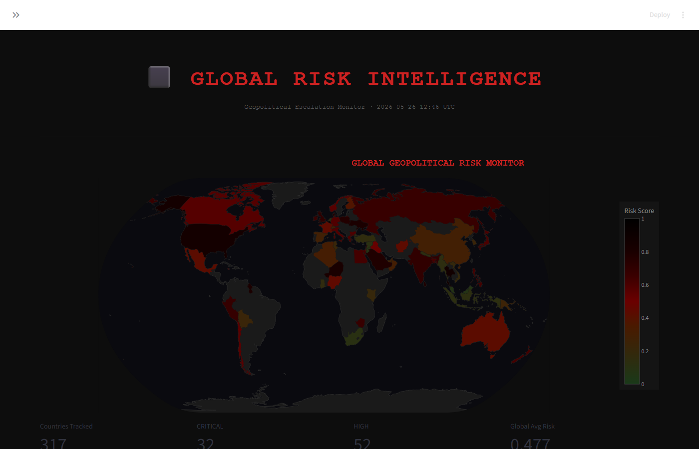

# GeoPulse — Global Risk Intelligence Platform

> **Geopolitical escalation monitoring and forecasting powered by GDELT**



Full-stack ML platform that ingests daily GDELT event exports, extracts per-country risk features, and runs a three-phase inference pipeline — all surfaced through a 7-page dark-themed intelligence dashboard.

| Phase | What it does |
|---|---|
| **1** | `HybridRiskTransformer` — multi-task risk scorer (instability, war probability, terrorism risk, financial stress) |
| **2** | Spillover network (Pearson-correlation graph), Integrated Gradients attribution, event cluster visualisation |
| **3** | `EscalationForecaster` (4-step bi-weekly horizon), `RiskGNN` (Graph Attention Network contagion), TF-IDF RAG advisories |

---

## Performance

Walk-forward backtest — 53 bi-weekly expanding-window folds, 210 countries, 35,102 predictions. All evaluation is strictly temporal with no future data leakage.

| Horizon | MAE | RMSE | Directional accuracy | Skill vs. carry-forward |
|---------|-----|------|---------------------|------------------------|
| **14 days** | 0.1620 | 0.1969 | 70.6% | +14.4% |
| **28 days** | 0.1616 | 0.1967 | 71.6% | +16.0% |
| **42 days** | 0.1618 | 0.1972 | 70.7% | +15.4% |
| **56 days** | 0.1616 | 0.1965 | 70.5% | +16.0% |

The 28-day directional accuracy of **71.6%** is comparable to the ~75% reported for Random Forest models on GDELT binary instability forecasting (Zebrowski & Afli, SBP-BRiMS 2025; arXiv:2411.06639), while operating on the harder continuous regression target. The **+16.0% skill** over carry-forward clears the key bar from the ViEWS Prediction Challenge (arXiv:2407.11045), where a no-change model outperformed all submitted ML entries under the TADDA directional metric.

**Confidence intervals:** Raw MC-Dropout covered only 13% of held-out actuals. Post-hoc split-conformal calibration (Angelopoulos & Bates, 2023) raises empirical coverage to **78%** with a distribution-free guarantee. Production intervals: ±0.26 per horizon.

---

## Architecture

```
GDELT (daily ZIP)
      │
      ▼
ingestion/  ──────────────────────────────────────────────────────────────
gdelt_downloader → gdelt_parser → event_cleaner → db_writer
      │
      ▼  PostgreSQL 18 / TimescaleDB
country_daily_features ─┬─► risk_scorer (Ph.1)  → country_risk_predictions
                        ├─► label_generator      → country_multitask_labels
                        ├─► event_clusterer      → event_clusters
                        ├─► spillover            → country_spillover
                        ├─► escalation_forecaster→ country_escalation_forecasts
                        ├─► gnn_spillover        → gnn_node_embeddings
                        └─► rag_engine           → advisory_corpus
      │
      ▼
FastAPI backend (30+ endpoints, MCP-compatible /riskscore)
      │
      ▼
Streamlit dashboard (7 pages)
```

---

## Tech Stack

| Layer | Technology |
|---|---|
| Language | Python 3.10+ |
| API | FastAPI 0.115 + Uvicorn |
| Database | PostgreSQL 18 + TimescaleDB + pgvector + PostGIS |
| ML | PyTorch 2.4 — Transformer encoder, seq2seq LSTM, 2-layer GAT |
| Dashboard | Streamlit 1.40 + Plotly 5.24 |
| Explainability | Integrated Gradients (custom) |
| RAG | TF-IDF cosine retrieval + optional Ollama |
| Deploy | Docker Compose |

---

## ML Models

**HybridRiskTransformer** — 3-layer Transformer encoder over a 90-day feature window → 5 parallel risk heads (risk_score, instability, war, terrorism, financial). Checkpoint: `models/real_data_model.pt`.

**EscalationForecaster** — 936k-param seq2seq LSTM, 4 autoregressive bi-weekly steps, MC-Dropout variance + split-conformal calibrated 80% CI. 71.6% directional accuracy, +16% skill over persistence. Checkpoint: `models/checkpoints/forecaster_v1_best.pt`.

**RiskGNN** — 2-layer GAT over a Pearson-correlation country graph (93 edges, threshold 0.25). Outputs contagion score and risk amplification per node; network-adjusted risk = clip(base + amplification × 0.15).

**Integrated Gradients** — signed feature attribution over the 14 input features for each Phase 1 prediction.

**RAG Advisory Engine** — TF-IDF retrieval over 30 seed situation templates + auto-generated cluster entries; top-5 analogues injected into advisory text alongside the 8-week forecast trajectory.

---

## API

FastAPI on `http://localhost:8000` — 30+ endpoints, Swagger UI at `/docs`.

Key endpoints: `GET /global/heatmap`, `GET /country/{code}/timeline`, `POST /riskscore` (MCP-compatible), `GET /country/{code}/forecast`, `GET /country/{code}/gnn_influence`, `GET /country/{code}/rag_advisory`, `GET /country/{code}/attributions`.

---

## Dashboard


| Page | What it shows |
|---|---|
| Global Risk Map | Plotly choropleth world map + top-20 risk table + 90-day timeline |
| Country Drilldown | Risk timeline, event clusters, Integrated Gradients attribution, spillover neighbours |
| Event Explorer | GDELT cluster browser with category/time filters and Goldstein intensity chart |
| Spillover Network | Global risk bar chart or ego-network view for any country |
| Escalation Forecast | 4-step forecast ribbon + per-task breakdown + global alerts table |
| GNN Network | GAT contagion graph — node colour by risk/contagion, country inspector panel |
| RAG Advisory | RAG vs rule-based advisory side-by-side, retrieved historical analogues |

---

## Quick Start

**Prerequisites:** Python 3.10+, PostgreSQL 18 with `timescaledb`, `pgvector`, `postgis`, `pg_trgm`, `btree_gin`.

```bash
git clone <repo-url> && cd geopulse
pip install -r requirements.txt
cp .env.example .env          # set POSTGRES_USER / PASSWORD / DB
```

```sql
-- as superuser:
CREATE ROLE gldt WITH LOGIN PASSWORD 'gldt_secret';
CREATE DATABASE gdelt_risk OWNER gldt;
\c gdelt_risk
\i docker/init.sql
```

```bash
python scripts/seed_db_from_cache.py   # seed from parquet cache (no GDELT download needed)
python -m uvicorn backend.main:app --port 8000 --reload
streamlit run streamlit_app/app.py --server.port 8502
```

**Docker (one command):**
```bash
cd docker && cp ../.env.example ../.env && docker compose up -d
# postgres:5432  backend:8000  streamlit:8502  ollama:11434 (optional)
```

---

## Training & Evaluation

```bash
# Phase 1 — risk scorer
python scripts/train_real_data.py

# Phase 3 — escalation forecaster
python scripts/train_forecaster.py

# Evaluation
python scripts/run_backtest.py          # 53-fold walk-forward backtest
python scripts/calibrate_intervals.py  # fit + report conformal calibration
python scripts/eval_risk_transformer.py
python scripts/eval_gnn_spillover.py
```

Configuration lives in `configs/settings.yaml`. Override any key via environment variables in `.env`.

---

> **Disclaimer:** For geopolitical analytics and risk monitoring only — not for operational targeting or military planning. Risk scores are derived from proxy event-frequency signals, not human-coded ground truth.
